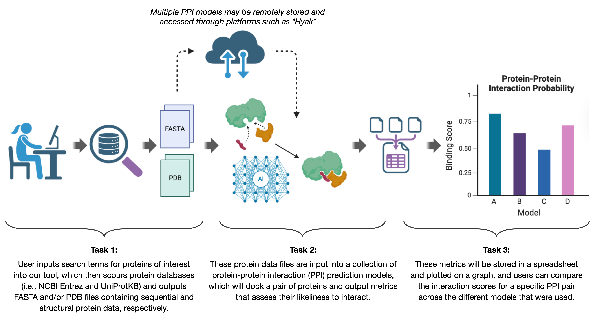

# PPInsight

A Python toolkit for benchmarking computational protein–protein interaction
(PPI) prediction models.  PPInsight automates protein data retrieval, runs
multiple docking engines, collects scores into a unified format, and
produces comparative visualisations.



## Contents

- [Install & quick start](#install--quick-start)
- [CLI reference](#cli-reference)
- [Tutorial](#tutorial)
- [FAQ](#faq)
- [Project structure](#project-structure)
- [Team members](#team-members)
- [License](#license)
- [Resources](#resources)

---

## Install & quick start

### One-command setup

```bash
bash setup.sh          # creates conda env, installs PyRosetta, pip install -e .
conda activate ppinsight
```

> `setup.sh` downloads PyRosetta (~1.5 GB) automatically.  To skip that
> step (e.g. if you only need HADDOCK / LightDock), run
> `bash setup.sh --no-rosetta`.

<details>
<summary>Manual step-by-step setup</summary>

```bash
conda env create -f environment.yml
conda activate ppinsight
python -c "import pyrosetta_installer; pyrosetta_installer.install_pyrosetta()"
pip install -e .
```
</details>

---

## CLI reference

PPInsight installs an umbrella command (`ppinsight`) with subcommands.
Each subcommand is also available as a standalone command:

| Umbrella form               | Standalone equivalent |
|-----------------------------|-----------------------|
| `ppinsight fetch`           | `protein_fetch`       |
| `ppinsight fetch-native`    | `ppinsight_fetch_native` |
| `ppinsight lightdock`       | `pdb_to_lightdock`    |
| `ppinsight haddock`         | `pdb_to_haddock`      |
| `ppinsight rosetta`         | `pdb_to_rosetta`      |
| `ppinsight collect`         | `collect_scores`      |
| `ppinsight compare`         | `compare_scores`      |
| `ppinsight parse`           | `parse_pairs`         |
| `ppinsight batch`           | `batch_dock`          |
| `ppinsight quality`         | `ppinsight_quality`   |
| `ppinsight prodigy`         | `ppinsight_prodigy`   |

The examples below use the umbrella form.  Replace
`ppinsight <subcommand>` with the standalone name if you prefer.

> **Tip:** every command accepts `--help`.  When in doubt, run
> `ppinsight <command> --help` to see all available options.

Before heavy runs, do these quick checks:

```bash
# Check which docking engines are currently runnable/parsible
ppinsight batch --list-engines

# Check which plot types and flags are valid for your scores file
ppinsight compare <scores_file.tsv> --guide
```

### 1. Fetch protein data

PPInsight fetches protein structures for you. You provide UniProt
identifiers, and it downloads sequences and PDB files automatically.
Accepted inputs include canonical accessions (for example `P15692`),
FASTA-style IDs (`sp|P15692|VEGFA_HUMAN`), and common human
gene/name forms such as `VEGFA` or `"VEGFA human"`.

The downloaded structures are saved with the same accession stems you
typed, for example `P69905.pdb`.  That means you can reuse those same
identifiers in later PPInsight steps without manual renaming. You can 
reuse those same identifiers later, including in the `proteinA` and 
`proteinB` columns of a batch pairs file.

```bash
# Give one or more UniProt identifiers.
# Downloaded PDB files land in --pdb-dir (default: data/input/)
# as accession-named files such as data/input/P69905.pdb.
ppinsight fetch P69905 P68871

# Name-style human inputs are also accepted and resolved to accessions.
ppinsight fetch "VEGFR2 human" "VEGFA human"
```

Optional flags: `--pdb-dir DIR` (override download location), `--fasta FILE`
(save FASTA sequences), `--csv FILE` (save metadata columns:
ID, Name, Description, Sequence Length, Sequence),
`--pdb-name accession|uniprot|both` (control output filename stems),
`--search TERM` (preview top reviewed-human UniProt matches without
downloading), `--remove ...` (delete mistaken local fetch outputs from
`--pdb-dir`), `--force` (overwrite existing local aliases).
Run `ppinsight fetch --help` for the full list.

### 1b. Find native experimental complexes

Use `ppinsight fetch-native` when you want a candidate native complex for a
specific pair rather than separate single-protein structures. The command
resolves both partners to UniProt accessions, searches RCSB biological
assemblies, and writes a candidate table with method, resolution,
stoichiometry, accession-to-chain mapping, and ready-to-download assembly
URLs.

```bash
# Inspect candidate native assemblies for one pair
ppinsight fetch-native P35968 P15692 \
    -o data/output/native_candidates.tsv

# Search many pairs and review candidate native assemblies
ppinsight fetch-native --pairs tutorials/demo_pairs.tsv \
    -o data/output/native_candidates.tsv

# Download one specific assembly after reviewing the table
ppinsight fetch-native P35968 P15692 \
    --select 3V2A-1 \
    --download-dir data/input/native_complexes
```

Review the candidate table first, then download the exact assembly you want
with `--select`. The `--pairs` input uses the same flat `proteinA` /
`proteinB` table format as `ppinsight batch`.

### 2. Run docking pipelines

Each docking command takes two positional arguments: **receptor** and
**ligand**.  These are PDB filenames (basenames or full paths).  Use
`--input-dir` to tell the CLI where the PDB files live.  By default,
all docking commands search `data/input/`.

```bash
# LightDock — minimum required: receptor, ligand
ppinsight lightdock 2UUY_rec 2UUY_lig --input-dir data/input/

# HADDOCK — minimum required: receptor, ligand
#   Without --run, only stages the config (lets you review before executing).
#   Add --run to also execute HADDOCK3.
ppinsight haddock 2UUY_rec 2UUY_lig --input-dir data/input/ --run

# Rosetta — minimum required: receptor, ligand (needs PyRosetta installed)
ppinsight rosetta 2UUY_rec 2UUY_lig --input-dir data/input/

# PPInsight auto-filters accession-named mixed complexes to accession-mapped
# chains for HADDOCK and Rosetta. Use --no-auto-filter only if you
# intentionally want the full deposited complex. See docs/FAQ.md for details.
ppinsight rosetta P35968 P15692 --input-dir data/input/ --no-auto-filter
```

Each engine has its own tuning flags (swarm count, number of runs,
scoring function, etc.).  Run `--help` to see them:

```
ppinsight lightdock --help
ppinsight haddock --help
ppinsight rosetta --help
```

### 3. Collect scores

After docking finishes, collect the raw outputs into a single unified
scores file.  The docking engine is auto-detected from the directory
contents.

```bash
# Point at one or more docking output directories.
# --pair tells collect which proteins are in this run.
# Without -o, collect auto-generates a descriptive TSV path under
# data/output/scores/ and avoids overwriting by adding numeric suffixes.
ppinsight collect data/output/lightdock_runs/2UUY_rec_vs_2UUY_lig/ \
    --pair 2UUY_rec:2UUY_lig
```

You can pass multiple directories (even from different engines) in one
call to build a combined scores file:

```bash
ppinsight collect \
    data/output/lightdock_runs/2UUY_rec_vs_2UUY_lig/ \
    data/output/haddock_runs/2UUY_rec_vs_2UUY_lig/ \
    --pair 2UUY_rec:2UUY_lig \
    -o data/output/scores/combined_scores.tsv
```

Alongside the scores file, `collect` writes a **run record**
(`<scores_file>.provenance.json`) that documents where the numbers came
from, including engine parameters and source directories.  The unified scores
rows also retain lightweight traceability columns when available
(`run_id`, `pose_id`, `output_path`, `source_file`) so you can tie a
plot back to a specific run and pose.

Use `--label-file` (legacy alias: `--pairs`) to add interaction labels.
For mixed multi-pair collections in one command, use `--pair-map`
(`directory,proteinA,proteinB`) or rely on run-directory names such as
`ProteinA_vs_ProteinB`.

Run `ppinsight collect --help` for aggregation options, cluster modes, etc.

### 4. Visualize & compare

```bash
# If you omit -o, compare auto-saves to data/output/plots/
# Violin plot (default) — always prints a tabular summary first
ppinsight compare data/output/scores/scores.tsv --metric dockq

# Ridge plot — compact density comparison across engines
ppinsight compare data/output/scores/scores.tsv --metric dockq \
    --plot-type ridge -o data/output/plots/ridge_dockq.png

# CDF — read off what fraction of poses exceed a threshold
ppinsight compare data/output/scores/scores.tsv --metric dockq \
    --plot-type cdf -o data/output/plots/cdf_dockq.png

# Filter by protein pair and save to PNG
ppinsight compare data/output/scores/scores.tsv --metric dockq \
    --pair 2UUY_rec:2UUY_lig -o data/output/plots/violin_2uuy.png

# Use --show to open interactively instead of auto-saving
ppinsight compare data/output/scores/scores.tsv --metric dockq --show

# Tabular summary only (no plot)
ppinsight compare data/output/scores/scores.tsv --metric dockq --table

# Metric-agnostic overview table (no metric required)
ppinsight compare data/output/scores/scores.tsv --table

# CAPRI quality classification (high/medium/acceptable/incorrect)
ppinsight compare data/output/scores/scores.tsv --capri-quality
ppinsight compare data/output/scores/scores.tsv --plot-type quality_bar \
    -o data/output/plots/quality.png

# Pairwise difference histogram — same metric, same pairs, two engines
ppinsight compare data/output/scores/scores.tsv --metric dockq \
    --plot-type difference --models HADDOCK LightDock \
    -o data/output/plots/difference_haddock_lightdock.png

# Scatter — most useful when many pairs are shared across two engines
ppinsight compare data/output/scores/scores.tsv --metric dockq \
    --plot-type scatter --models HADDOCK LightDock \
    -o data/output/plots/scatter_haddock_lightdock.png

# Compare per-model files side by side
ppinsight compare haddock_scores.tsv rosetta_scores.csv \
    --metric score --names HADDOCK Rosetta

# Discover what's in a scores file
ppinsight compare data/output/scores/scores.tsv --list-metrics
ppinsight compare data/output/scores/scores.tsv --list-pairs
```

Run `ppinsight compare --help` for all plot types, filtering, and export options.
Use `ppinsight compare data/output/scores/scores.tsv --guide` for a
data-aware summary of which plot types and flags work with your specific
scores file.

The supported CLI plot types are `violin`, `ridge`, `roc`, `scatter`,
`quality_bar`, `cdf`, and `difference`.

### 5. Parse interaction tables & batch-dock

```bash
# Parse a protein interaction table (matrix format) into a flat pairs CSV.
# The pairs file lists (proteinA, proteinB, label) rows.
ppinsight parse data/input/pairs/my_proteins.tsv \
    -o data/input/pairs/pairs.csv --stats

# Batch-dock all pairs — start with --dry-run to preview.
ppinsight batch data/input/pairs/pairs.csv \
    --engines lightdock haddock --dry-run

# Run for real, pointing at the directory with your PDB files.
ppinsight batch data/input/pairs/pairs.csv \
    --engines lightdock --pdb-dir data/input/

# Limit to first N pairs for a quick test
ppinsight batch data/input/pairs/pairs.csv --engines lightdock --limit 5
```

The pairs file consumed by `ppinsight batch` has two required columns
(`proteinA`, `proteinB`) and an optional `label` column
(`interaction` / `non-interaction`).  You can create one with
`ppinsight parse` or by hand.  See [`data/README.md`](data/README.md)
for the full format spec.

### 6. Evaluate docking quality (DockQ)

```bash
# Score a docked model against a native structure
ppinsight quality model.pdb native.pdb

# Append DockQ/CAPRI evaluation rows directly to a collected scores file
ppinsight quality data/output/scores/scores.tsv native.pdb \
    -o data/output/scores/scores_quality.tsv

# Or score a docking run directory directly
ppinsight quality data/output/lightdock_runs/2UUY_rec_vs_2UUY_lig/ native.pdb \
    --engine lightdock \
    -o quality.tsv
```

> Requires the optional `quality` extra. From this repo checkout, install it with
> `pip install -e '.[quality]'`. If you are installing by package name in `zsh`, quote
> the brackets: `pip install 'ppinsight[quality]'`.

If your scores file came from `ppinsight collect`, `ppinsight quality` reads
each pose from its `output_path` value and appends DockQ/CAPRI evaluation rows
back into a new unified scores file.

### 7. Predict binding affinity (PRODIGY)

```bash
# Score collected poses with predicted binding affinity
ppinsight prodigy data/output/scores/scores.tsv \
    --output data/output/scores/scores_prodigy.tsv

# Fallback for scores tables assembled outside ppinsight collect
ppinsight prodigy external_scores.tsv \
    --pdb-dir data/output/lightdock_runs/2UUY_rec_vs_2UUY_lig/ \
    --output data/output/scores/external_scores_prodigy.tsv
```

`ppinsight prodigy` adds `prodigy_ddg` and `prodigy_kd`, which are most
useful after you have narrowed candidates with docking scores and, when
available, DockQ/CAPRI quality evaluation.

> Requires the optional `prodigy` extra. From this repo checkout, install it with
> `pip install -e '.[prodigy]'`. If you are installing by package name in `zsh`, quote
> the brackets: `pip install 'ppinsight[prodigy]'`.

These examples work best when the scores file came from `ppinsight collect`
and already stores each pose path in `output_path`. Use `--pdb-dir` only for
manually assembled or external scores tables that keep bare `pdb` filenames.

---

## Tutorial

A complete end-to-end walkthrough is in [`tutorials/README.md`](tutorials/README.md).
It uses pre-computed docking outputs from all three engines, so no external
tools are required.  Start there to see every `ppinsight compare` plot type
and the full collect → compare → classify workflow.

Additional walkthrough assets live under [`examples/`](examples/) (including
fabricated plotting galleries and engine-specific sample outputs). For common
troubleshooting questions, see [`docs/FAQ.md`](docs/FAQ.md).

## FAQ

Common setup, plotting, CAPRI, and PRODIGY questions are covered in
[`docs/FAQ.md`](docs/FAQ.md).

### Three-layer evaluation

PPInsight supports three complementary comparison layers:

1. Within-model: use `violin`, `ridge`, and `cdf` on engine-native scores to inspect one engine's pose distribution.
2. Cross-model: use DockQ/CAPRI-derived metrics with `quality_bar`, `cdf`, `scatter`, and `difference` to compare engines on the same protein pair when you have an experimental reference structure for that pair.
3. Cross-system: use `ppinsight prodigy` with `prodigy_ddg` and `prodigy_kd` when you need a post-hoc affinity view across different complexes.

---

## Project structure

```
src/ppinsight/
  cli.py               # Umbrella ppinsight CLI
  protein_fetch.py      # UniProt / PDB data retrieval
  pdb_to_lightdock.py   # LightDock docking wrapper
  pdb_to_haddock.py     # HADDOCK3 staging & execution
  pdb_to_rosetta.py     # PyRosetta docking wrapper
  collect_scores.py     # Score aggregator (unified TSV/CSV)
  visualizer.py         # Plotting and ppinsight compare implementation
  batch_dock.py         # Batch docking for all pairs
  parse_pairs.py        # Protein interaction table → pairs file
  quality.py            # DockQ quality evaluation
  prodigy.py            # PRODIGY binding-affinity scoring
  provenance.py         # Run-level metadata & record I/O
  utils.py              # Shared utilities (path resolution)
  rosetta/              # PyRosetta pipeline internals
data/                   # User I/O: input PDBs & pairs → output docking runs
tests/                  # pytest test suite
tutorials/              # End-to-end walkthrough with pre-built scores & sample plots
examples/               # Per-engine sample I/O and test fixtures
docs/                   # Specs, use cases, and slide deck
```

### User input & output directories

The **`data/`** directory at the repository root is the default working
directory for pipeline runs.  The pipeline reads from `data/input/` and
writes to `data/output/`.

> `examples/` is for sample data, tutorials, and test fixtures only.

```
data/
├── input/
│   ├── *.pdb              # PDB structures (from ppinsight fetch or manual)
│   └── pairs/             # Batch-mode CSV / TSV files
│
└── output/
    ├── haddock_runs/      # HADDOCK docking outputs
    ├── lightdock_runs/    # LightDock docking outputs
    ├── rosetta_runs/      # Rosetta docking outputs
    ├── scores/            # Unified scores & batch results
    └── plots/             # Saved figures
```

**Inputs — where to put it**

| What you have                    | Where to put it              |
|----------------------------------|------------------------------|
| PDB structures                   | `data/input/`                |
| Protein interaction table (TSV)  | `data/input/pairs/`          |
| Parsed pairs file                | `data/input/pairs/`          |

**Outputs — where to find it**

| What the tool produces           | Default location                         |
|----------------------------------|------------------------------------------|
| Docking outputs                  | `data/output/<engine>_runs/`             |
| Unified scores file              | auto-named in `data/output/scores/` (or your `-o` path) |
| Batch results table              | `data/output/scores/batch_results.csv`   |
| Run record (provenance)          | `<scores_file>.provenance.json` alongside your scores file |
| Plots / figures                  | auto-saved in `data/output/plots/` (or use `-o` / `--show`) |

All default paths can be overridden with CLI flags (`--input-dir`,
`--pdb-dir`, `--output-root`, `-o`).  See [`data/README.md`](data/README.md)
for the full layout and pairs file format.

### Notes

- For HPC runs, pass an absolute `--output-root` to place outputs on a
  shared filesystem (e.g. `/gscratch/...`).
- `--output-root` controls where engine run directories are created in
    batch mode; it does not set the batch results table path (use `-o`).
- External docking tools must be installed separately for the engines
  you want to use.  The HADDOCK helper supports container execution
  (`--container docker|apptainer`).

---

## Team members

| Name | Contributions |
|------|--------------|
| **Ike Keku** | Co-developed PPI predictor pipelines (`pdb_to_haddock`, `pdb_to_lightdock`), oversaw general workflow |
| **Rita Kamenetskiy** | Co-developed protein data fetching (`protein_fetch`), packaging, CI tests |
| **Fiona McLary** | Developed visualiser module |
| **Walter Avila** | Co-developed `protein_fetch` and corresponding tests |
| **Maya Gatt Harari** | Developed Rosetta integration (`ppinsight/rosetta`) |

---

## License

See [LICENSE](LICENSE).

## Resources

- [Biopython Entrez guide](https://biopython.org/wiki/Entrez)
- [RCSB API docs](https://data.rcsb.org/)
- [DockQ](https://github.com/bjornwallner/DockQ)
- [HADDOCK docs](https://wenmr.science.uu.nl/haddock2.4/)
- [LightDock](https://github.com/lightdock/lightdock)
- [Rosetta / PyRosetta](https://rosettacommons.org)

### CAPRI quality classification thresholds

The `--capri-quality` flag and `quality_bar` plot classify docked
predictions into four tiers (high / medium / acceptable / incorrect)
using published community thresholds:

| Source | DOI | Used for |
|--------|-----|----------|
| Lensink MF, Velankar S, Wodak SJ (2016). *Proteins* 84(S1):323-348 | [10.1002/prot.25007](https://doi.org/10.1002/prot.25007) | fnat + Lrms + irms thresholds (Table 3) |
| Basu S, Wallner B (2016). *PLoS ONE* 11(8):e0161879 | [10.1371/journal.pone.0161879](https://doi.org/10.1371/journal.pone.0161879) | DockQ fallback thresholds |
